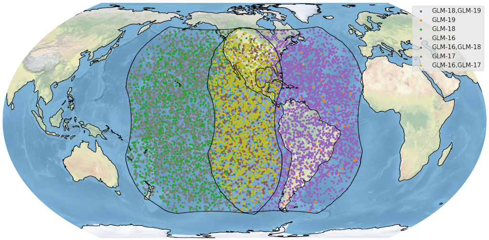

.. GLM Bolide Pipeline documentation master file, created by
   sphinx-quickstart on Fri Jun  4 15:57:48 2021.
   You can adapt this file completely to your liking, but it should at least
   contain the root `toctree` directive.

Welcome to the GOES GLM Bolide Pipeline documentation!
======================================================

Welcome to your first day working with the GOES GLM Bolide Pipeline! I hope your stay is exciting and full of joy.

*GOES-bolide-detection* is a python-based automated pipeline to search for bolides in GOES weather satellite data.  It
detects bolides principally using the Geostationary Lightning Mapper instruments onboard the GOES-16, 17, 18 and 19
satellites, https://www.goes-r.gov/spacesegment/glm.html.  Detected bolides are posted at `neo-bolide.ndc.nasa.gov
<https://neo-bolide.ndc.nasa.gov>`_. We now have over 9500 bolides posted on our website as illustrated with the
following graphic, created using our bolides user package: https://github.com/SETI/bolides.  This image shows over 9500
detected bolides and highlights which GOES satellite the detection was made with by color. In the stereo region, where
GOES-East and GOES-West fields of view overlap, the detections can be made by two satellites, hence the numerous
different colors.

The GOES GLM Bolide Pipeline is a project through NASA's Asteroid Threat Assessment Project (ATAP), funded by NASA's
Planetary Defense Coordination Office (PDCA).  The main code repository and environment variables use the acronym
"ATAP". There are also many references to the NASA Advanced Supercomputer facility (NAS) in this documentation. If you
are using the public code repository and wonder where all this "ATAP" and "NAS" references come from, now you know!

Any questions should be directed to Jeffrey C. Smith, jsmith@seti.org.

Citation
========

If you wish to use this software please reference this paper:

Jeffrey C. Smith, Robert L. Morris, Clemens Rumpf, Randolph Longenbaugh, Nina McCurdy, Christopher Henze, Jessie Dotson,
An automated bolide detection pipeline for GOES GLM, Icarus, Volume 368, 2021, 114576, ISSN 0019-1035, 
https://doi.org/10.1016/j.icarus.2021.114576. ::

    @article{SMITH2021114576,
    title = {An automated bolide detection pipeline for GOES GLM},
    journal = {Icarus},
    volume = {368},
    pages = {114576},
    year = {2021},
    issn = {0019-1035},
    doi = {https://doi.org/10.1016/j.icarus.2021.114576},
    url = {https://www.sciencedirect.com/science/article/pii/S0019103521002451},
    author = {Jeffrey C. Smith and Robert L. Morris and Clemens Rumpf and Randolph Longenbaugh and Nina McCurdy and Christopher Henze and Jessie Dotson},
    keywords = {Bolide detection, GOES GLM, Random forest classifier},
    }

This is experimental code maintained mainly by one person who has plenty of other stuff to do. 
So don't expect it to work perfectly or bug-free. I hope the documentation here is a helpful guide for the new
user.

Contents
========
.. toctree::
    :maxdepth: 2

    source_code_repo
    python_environment
    running_the_pipeline
    running_the_quick_pipeline
    running_post_detection_analyses
    examining_the_results
    validation_of_detections
    atap_glossary
    software_releases
    troubleshooting
..
    API Refrence
    ============
    .. toctree::
        :maxdepth: 2

        API

Indices and tables
==================

* :ref:`genindex`
* :ref:`modindex`
* :ref:`search`
